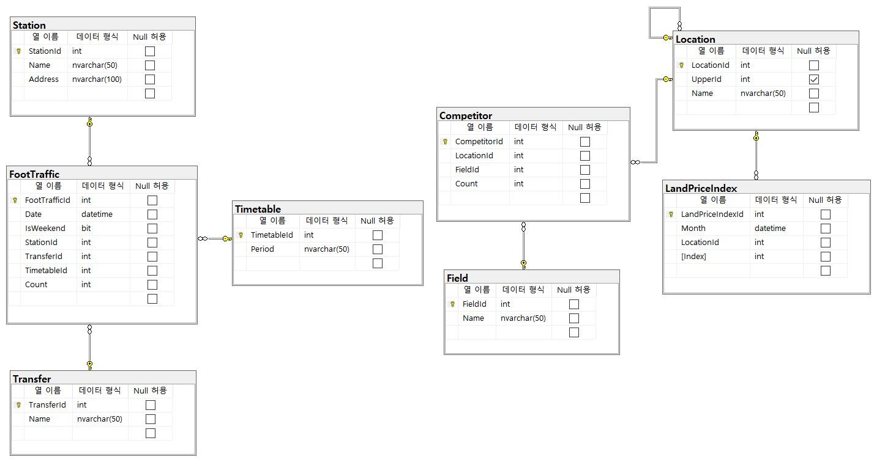
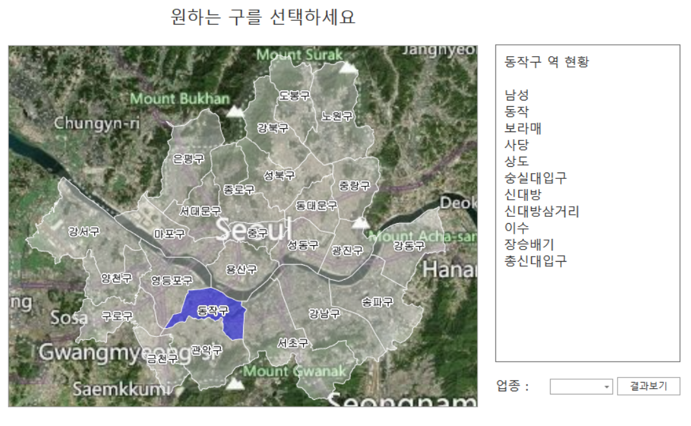
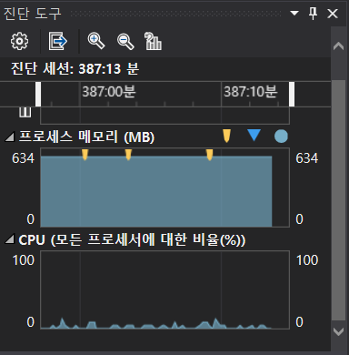
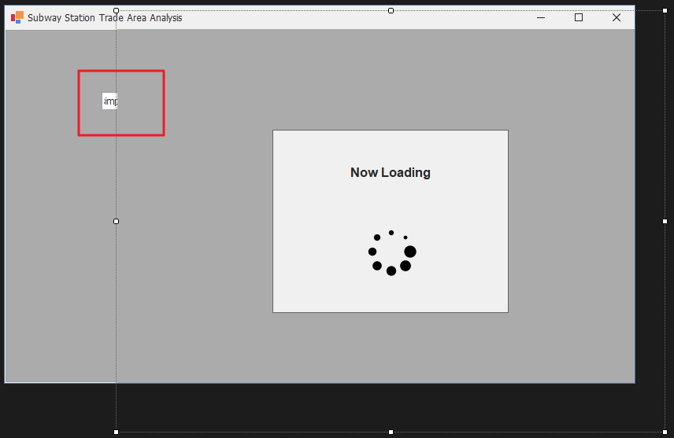

# SSTAA : Subway Station Trading
# 개요

- C# .NET Framework와 EntityFramework 및 DevExpress를 이용해 서울시 내 각 구별 상권분석용 프로그램을 개발하였다.

# 개발 기간

- 2020년 12월 28일 ~ 2021년 01월 08일

# 참여 인원

- IoT기반 스마트팩토리 SW개발 전문가과정
- 김대근, 안성윤, 이동희 총 3명

# 주요 기능

## 출력 기능

### 추천상권을 보고싶은 구 선택(서울시)

<div>
<a href="./Document/screen/메인화면.png" target="_blank">

</a>
<a href="./Document/screen/해당구및업종선택화면.png" target="_blank">

</a>
<a href="./Document/screen/로딩화면.png" target="_blank">

</a>
</div>

- 해당구 선택, 업종 선택
- 해당구 선택 기능은 DevExpress Mapcontrol로 구현


### 해당구 연도별 평가점수

<div>
<a href="./Document/screen/연도별평가점수및추천역세권.png" target="_blank">

</a>
</div>

- 선택된 구에 해당되는 지하철역 평가점수 순서로 추천

### 연도별 평가점수 세부내역

<div>
<a href="./Document/screen/선택역세부내역.png" target="_blank">

</a>
</div>

- 지하철역 더블클릭시 해당역 세부내역 출력

## 평가점수 계산식
 
<div>
<a href="./Document/screen/수식안내.png" target="_blank">

</a>
</div>

- 해당내용 이슈 #7 참고

## 입력 기능

- Excel(.xls).csv 파일 DB 저장 기능

<a href="./Document/주요기능/파일임포터.jpg" target="_blank">

</a>

- 해당 형식의 파일 선택 후 서버(DB)에 저장 가능

# 사용 기술

## 언어

- C# 8.0

## 프레임워크

- .Net FrameWork 4.8
- EntityFrameWork 6.2
- Winform

## 데이터베이스

* MSSQL Server 2019

## Third Party

- DevExpress 20.2.3 (Trial Version)

## 기타 개발환경

- Windows 10
- Microsoft Visual Studio Community 2019 v16.8
- Microsoft SQL Server Management Studio v18.6

# 데이터베이스 스키마


- 모든 항목이 제 3 정규화까지 완료됐다

# 유저 케이스 다이어그램


# 플로우차트


# 클래스 다이어그램

## DAO(Data Access Object)


# 시퀸스 다이어그램

## 여객 수입 시퀸스


# Point of Interest

# 계산식이 작동되는 시간이 너무 오래 걸리는 문제 [#42](https://github.com/dlehd333/SSTAA/issues/42)

## 증상(문제)

- 계산식이 작동되는 시간이 너무 오래 걸리는 문제

## 원인

- 작성한 계산식을 코드로 입력하여 실제 계산을 진행하였는데, 시간이 너무 오래걸렸다
- 동대문구, 커피전문점 기준 약 2분
- 원인은 계산을 위해 잦은 DB의 접근, 특히나 덩치가 큰 DB에 접근하는 횟수가 많은 것으로 판단했다.

## 결과(해결방안)

- DB에 접근하는 횟수가 적어질 수록 빨라질 것이라 판단하여, 계산식을 작동시키면 먼저 필요한 데이터를 전부 DB에 접근하여 받아온 다음 계산식이 진행되는 동안에는 DB에 접근하지 않도록 프로그래밍함
- 그 결과, 생각 이상으로 시간을 줄이는 데 성공함
- 동대문구, 커피전문점 기준 약 12초

## 참고할 코드나 스크린샷

```c#
public List<AnnualEvaluationScoreModel> GetAnnualEvaluationScoreModels(int upperLocationId, int fieldId)
{
  // 미리 DB에 접근하여 필요한 만큼 데이터를 가져오는 부분
  List<Station> stations = Dao.Station.GetByUpperLocation(upperLocationId);
  List<LandPriceIndex> landPriceIndices = Dao.LandPriceIndex.GetByLocation(upperLocationId);
  List<Competitor> competitors = Dao.Competitor.GetByField(fieldId);
  // 계산을 진행하여 모델을 생성하는 부분. DB에 접근할 일이 없이 컬렉션의 데이터로 계산을 진행한다
  List<AnnualEvaluationScoreModel> models = new List<AnnualEvaluationScoreModel>();
  foreach(var station in stations)
  {
    // ...
  }
  // ...
  return models;
}
```
---

# SHP 파일을 이용한 MapControl의 내부 정보를 읽어오는 문제 [#41](https://github.com/dlehd333/SSTAA/issues/41)

## 증상(문제)

- MapControl에서 지정된 영역을 선택한 후, 해당 지역의 데이터를 shp파일에서 읽어오려고 했으나 방법을 찾지 못하였다.

## 원인

- shp 형식을 제대로 이해한 상태가 아니었다.
- MapControl에서 Region, MapItem, Object을 구분하지 못하였다.
- 원하는 데이터에 접근하는 방법을 찾으려고 했다.

## 결과(해결방안)

- shp 형식이 3개 형태의 파일들이 합쳐진 vector 데이터 라는 것을 이해하였다. 또한, 각 요소들을 구분하여, 원하는 데이터에 접근하기 위해서 필요한 요소를 알아내었다.
- 해당 값들은 MapItem.Data.Attributes로 접근할 수 있었으며, 벡터형식(binary reading)으로 저장되어 있었기에 인코딩이 필요했다.
- shapeFileAdapter를 이용해 vectorItemsLayer에 해당 데이터를 load할 때 필요한 형식으로 인코딩을 한 후, 이후 불러온 데이터를 string으로 캐스팅하여 필요한 곳에 사용하였다.

##참고할 코드나 스크린샷



```c#
shapefileDataAdapter1.DefaultEncoding = Encoding.GetEncoding(51949);
            shapefileDataAdapter1.FileUri = new Uri(_path[0], UriKind.Absolute);

            mapControl1.CenterPoint = new GeoPoint(37.5656754986042d, 126.98202985079d);
            mapControl1.ZoomLevel = 10.8d;

            vectorItemsLayer1.ItemStyle.Fill = Color.FromArgb(90, Color.White);
            vectorItemsLayer1.ItemStyle.Stroke = Color.White;
            vectorItemsLayer1.SelectedItemStyle.Fill = Color.FromArgb(120, Color.Blue);
```

---

# 크기가 큰 데이터를 한꺼번에 DB에 저장할 때 메모리 문제가 발생하는 문제 [#23](https://github.com/dlehd333/SSTAA/issues/23)

## 증상(문제)

- csv file의 내용을 DB에 저장하려는데, 메모리 문제가 발생

## 원인

- FootTraffic 테이블에 들어갈 csv파일 데이터를 EF를 이용해 저장하려고 했는데, 프로그램이 버벅대고 진행되지 않는 문제가 발생
- 원인 해결을 위해 처음에는 직접 저장하는 대신 Query문을 만들어 SQL파일로 SSMS를 이용해 저장하려고 함
- 하지만 SSMS에서도 Query문이 너무 길어서 메모리 문제가 발생(SSMS가 32bit로 작동하기 때문인 것으로 추측됨)

## 결과(해결방안)

- 그래서 선생님과 논의한 결과, 해당 CSV파일의 데이터를 전부 읽어서 한꺼번에 입력하는 것이 아니라 한 줄씩 읽어서 입력하는 방식으로 수정함
- 비록 느리기는 하지만 차근차근 DB에 값이 들어가고 있고, Visual Studio 디버그 모드의 진단 도구를 통해 메모리 문제가 발생하지 않는것을 확인함

## 참고할 코드나 스크린샷

```c#
// before
for(int i = 0;i < rows.Count;i++)
{
  // ...
}
// for문으로 파일의 내용을 전부 읽어들인 다음 DB에 입력
using (var context = DbContextCreator.Create())
{
  context.FootTraffics.AddRange(footTraffics);
  context.SaveChanges();
}
// -----------------------------------------------------------------
// after
for(int i = 0;i < rows.Count;i++)
{
  // ...
  // 한 줄을 읽은 다음 DB에 입력
  using (var context = DbContextCreator.Create())
  {
    context.FootTraffics.AddRange(footTraffics);
    context.SaveChanges();
  }
}
```


---

# 투명 배경의 유저 컨트롤이 다른 컨트롤을 가리는 문제 [#9](https://github.com/dlehd333/SSTAA/issues/9)

## 증상(문제)

- 유저 컨트롤을 투명하게 만들어도 다른 컨트롤이 보이지 않는 문제

## 원인

- 로딩 시에 출력되는 팝업 형태의 컨트롤을 만들고 싶었는데, 주변 다른 컨트롤은 작동되지 않도록 하고 싶었다
- 그래서 유저 컨트롤을 만들고 배경을 Transparent로 설정한 다음 팝업 역할을 할 Panel을 만들었다.
- 이후에 폼에 불러왔는데, 폼에 있던 다른 컨트롤이 가려지는 문제가 발생했다

## 결과(해결방안)

- 그래서 컨트롤을 투명하게 할 다른 방법을 찾아보기도 하고, DevExpress에서 제공하는 XtraUserControl로 가능한지 확인해봤지만 같은 결과만 나왔다.
- 결국, 팝업은 폼으로 다시 만들고, 폼을 ShowDialog로 출력하여 다른 컨트롤이 제어되지 않도록 하는 방식으로 선회하기로 했다.
- 유저 컨트롤을 투명하게 만들어 다른 컨트롤이 비치지만 도달하지 못하는 형태를 구현하기 원했지만, 유저 컨트롤도 컨트롤이기 때문에 기본적으로 자신보다 아래에 있는 컨트롤을 가린다는 사실을 알게 되었다.

## 참고할 코드나 스크린샷
