# SSTAA : Subway Station Trading Area Analysis
# 개요

- C# .NET Framework와 EntityFramework 및 DevExpress를 이용해 서울시 내 각 구별 상권분석용 프로그램을 개발하였다.

# 개발 기간

- 2020년 12월 28일 ~ 2021년 01월 08일

# 참여 인원

- IoT기반 스마트팩토리 SW개발 전문가과정
- 김대근, 안성윤, 이동희 총 3명

# 주요 기능

## 출력 기능(SSTAA.WinForm)

### 추천상권을 보고싶은 구 선택(서울시)

<a href="./Document/screen/메인화면.png" target="_blank">
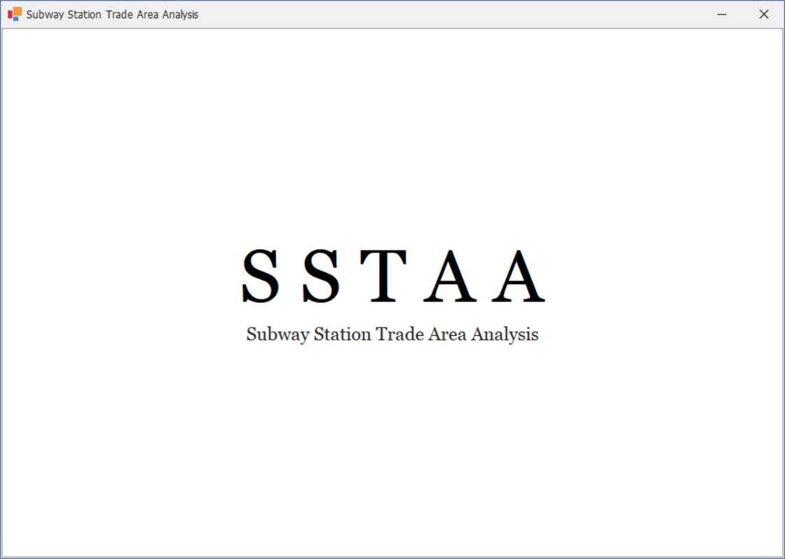
</a>
<a href="./Document/screen/해당구및업종선택화면.png" target="_blank">
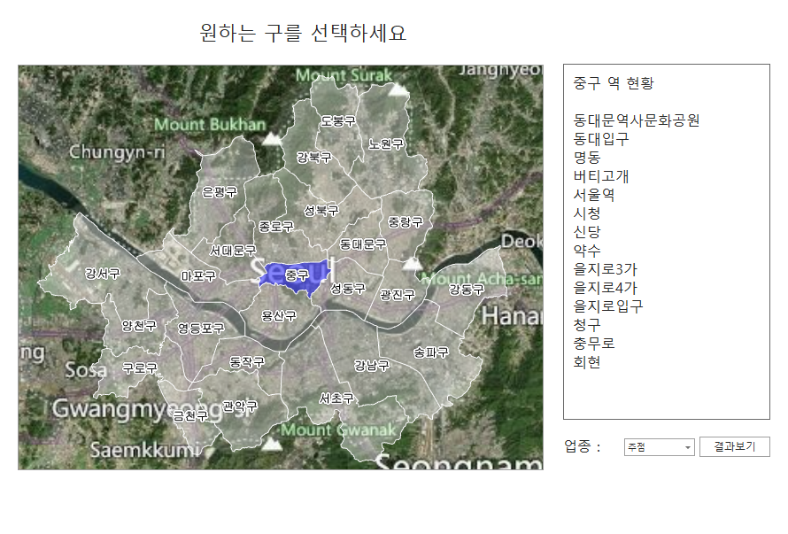
</a>
<a href="./Document/screen/로딩화면.png" target="_blank">
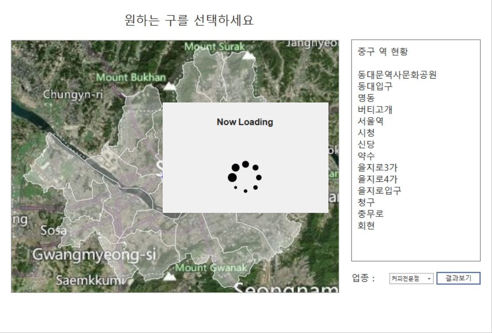
</a>

- 해당구 선택, 업종 선택
- 해당구 선택 기능은 DevExpress MapControl로 구현

### 해당구 연도별 평가점수

<a href="./Document/screen/연도별평가점수및추천역세권.png" target="_blank">
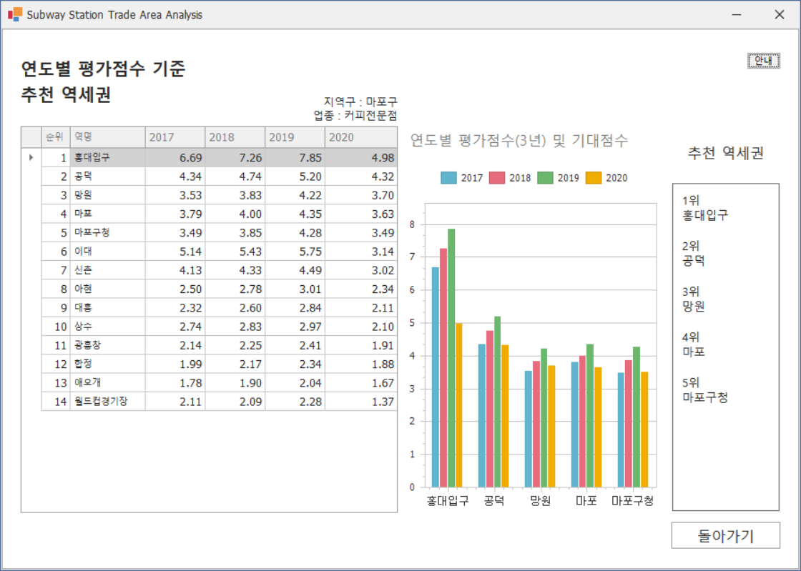
</a>

- 선택된 구에 해당되는 지하철역 평가점수 순서로 추천

### 연도별 평가점수 세부내역

<a href="./Document/screen/선택역세부내역.png" target="_blank">
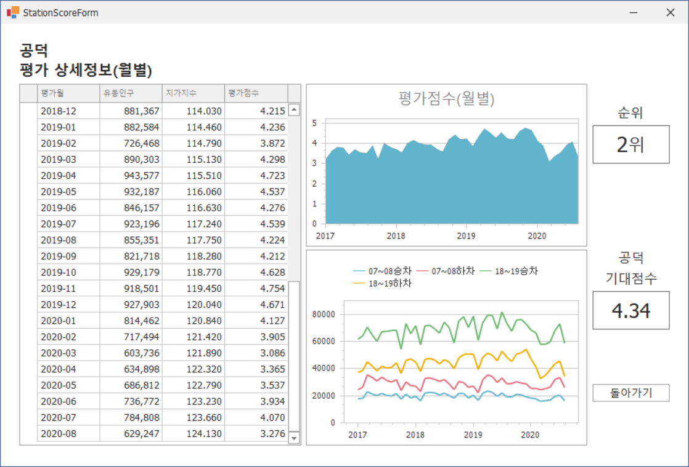
</a>

- 지하철역 더블클릭시 해당역 세부내역 출력

### 평가점수 계산식
 

<a href="./Document/screen/수식안내.png" target="_blank">
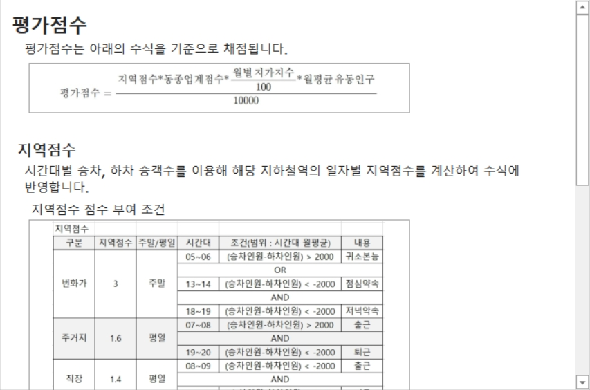
</a>

- 해당내용 [Issue #7](https://github.com/dlehd333/SSTAA/issues/7) 참고

## 입력 기능(SSTAA.Import)

<a href="./Document/screen/파일임포터.png" target="_blank">
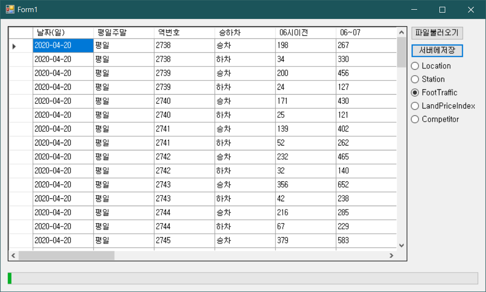
</a>

- csv 파일을 DB에 저장하는 기능 구현
- Entity에 맞는 형식의 파일 선택 기능, 서버(DB)에 저장하는 기능으로 나뉜다
- 작업을 위해서만 사용(범용으로 사용하기 어려움)

# 사용 기술

## 언어

- C# 8.0

## 프레임워크

- .Net FrameWork 4.8
- EntityFrameWork 6.2
- Winform

## 데이터베이스

* MSSQL Server 2019

## Third Party

- DevExpress 20.2.3 (Trial Version)

## 기타 개발환경

- Windows 10
- Microsoft Visual Studio Community 2019 v16.8
- Microsoft SQL Server Management Studio v18.6

# 데이터베이스 스키마

- 모든 항목이 제 3 정규화까지 완료됐다

# 유저 케이스 다이어그램

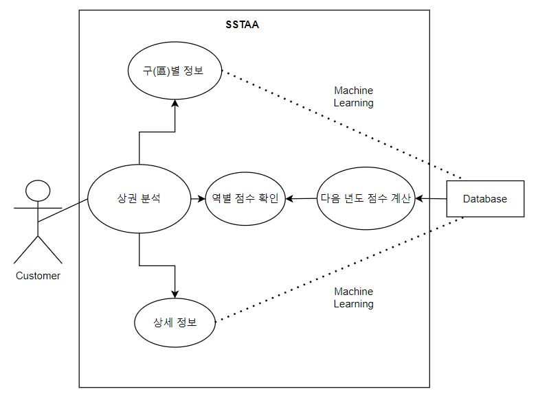

# 플로우차트

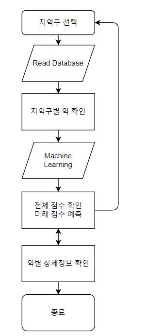

# 클래스 다이어그램

## DAO(Data Access Object)

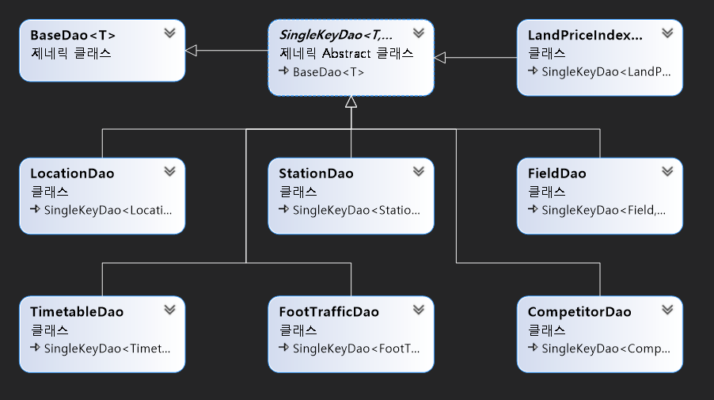

# 시퀸스 다이어그램

## 평가점수 계산 시퀸스

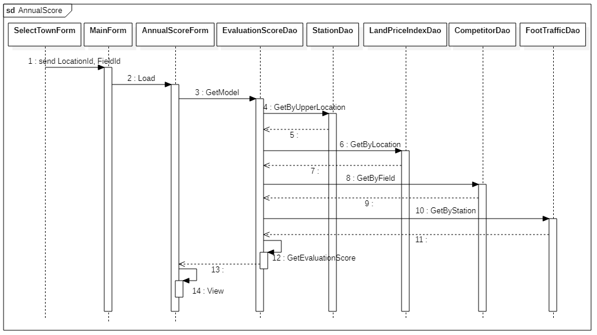

# Point of Interest

